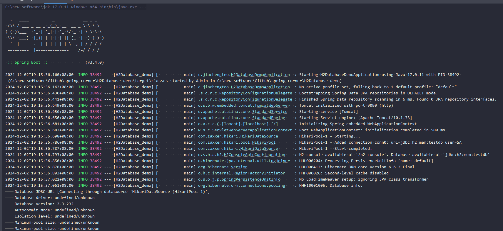
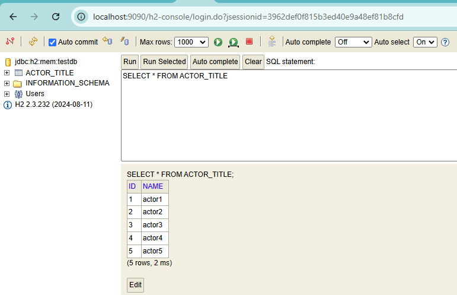

# H2 Spring Boot Demo

## Screenshots





## Description

https://www.youtube.com/watch?v=33OWc59wsuc

- YouTube video on how to create a spring boot application with h2 database

http://localhost:9090/h2-console

- access the h2 database console
- actor_title table is automatically created by JPA

```
jdbc:h2:file:C:/new_software/GitHub/spring-corner/H2Database_demo/data/testdb
```

```h2
SHOW COLUMNS FROM ACTOR_TITLE;
```